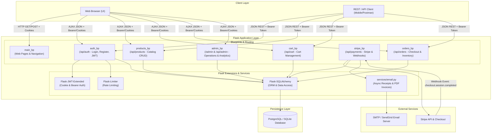
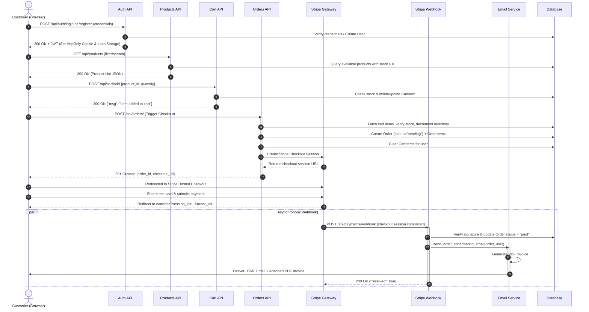

# Architecture & Workflow Documentation

This document describes the architectural layers, system components, data models, purchase flow, and authentication strategy for the **FreshMart Grocery Store** platform.

---

## 1. System Component & Layer Diagram

---

## 2. Purchase Flow Sequence Diagram

The end-to-end purchasing workflow from product selection to Stripe checkout and automated invoice fulfillment:

---

## 3. Data Model (Entity-Relationship Diagram)

```mermaid
erDiagram
    USER ||--o{ CART_ITEM : "has many"
    USER ||--o{ ORDERS : "places many"
    PRODUCT ||--o{ CART_ITEM : "referenced in"
    PRODUCT ||--o{ ORDER_ITEM : "referenced in"
    ORDERS ||--|{ ORDER_ITEM : "contains"
    COUPON ||--o{ ORDERS : "applied to"

    USER {
        int id PK
        string email UK "nullable=False"
        string password_hash "nullable=False"
        string name "nullable=True"
        string role "default='customer'"
        datetime created_at
    }

    PRODUCT {
        int id PK
        string name "nullable=False"
        text description "nullable=True"
        numeric price "10,2 - nullable=False"
        string uom "unit, kg, bunch, etc."
        int stock "nullable=False, default=0"
        string category "nullable=True"
        string image_url "nullable=True"
        datetime created_at
    }

    CART_ITEM {
        int id PK
        int user_id FK "nullable=False"
        int product_id FK "nullable=False"
        int quantity "default=1"
        datetime added_at
    }

    ORDERS {
        int id PK
        int user_id FK "nullable=False"
        numeric total_amount "10,2"
        numeric discount_amount "10,2, default=0"
        int coupon_id FK "nullable=True"
        string status "pending, paid, shipped, delivered, cancelled"
        string shipping_address "nullable=True"
        string tracking_number "nullable=True"
        datetime created_at
    }

    ORDER_ITEM {
        int id PK
        int order_id FK "nullable=False"
        int product_id FK "nullable=False"
        numeric price "10,2 snapshot price"
        int quantity "default=1"
    }

    COUPON {
        int id PK
        string code UK "nullable=False"
        numeric discount_percent "5,2 - e.g. 10.00"
        boolean active "default=True"
        datetime expiry_date
        datetime created_at
    }
```

---

## 4. Authentication Strategy (Dual Header + Cookie JWT)

The platform implements a unified authentication architecture using `Flask-JWT-Extended` with dual location verification:

1. **Browser Navigation & Server-Side Rendering**:
   - On `/api/auth/login` and `/api/auth/register`, the response includes an `httpOnly` cookie (`access_token_cookie`) configured with `SameSite=Lax`.
   - When a browser visits protected UI pages (like `/cart`, `/orders`, or `/admin`), Flask inspects the cookie automatically.
   - If the cookie is missing or expired on a web page request, the application gracefully redirects the user to `/login`.

2. **Single-Page App & API Clients**:
   - In addition to cookies, responses return `{ "access_token": "<jwt>" }`.
   - Client-side JavaScript stores the token and includes `Authorization: Bearer <token>` on asynchronous `fetch()` requests.
   - External API consumers (cURL, mobile apps, Postman) authenticate purely via the `Authorization` header.
   - Unauthorized API requests receive a standardized `401 Unauthorized` JSON payload (`{ "msg": "Missing authorization token" }`).

3. **Role-Based Access Control (RBAC)**:
   - User claims include `role: "customer"` or `role: "admin"`.
   - Administrative endpoints (`/admin`, `/api/products` POST/PUT/DELETE, `/api/admin/...`) verify `role == "admin"`, returning `403 Forbidden` if unauthorized.
